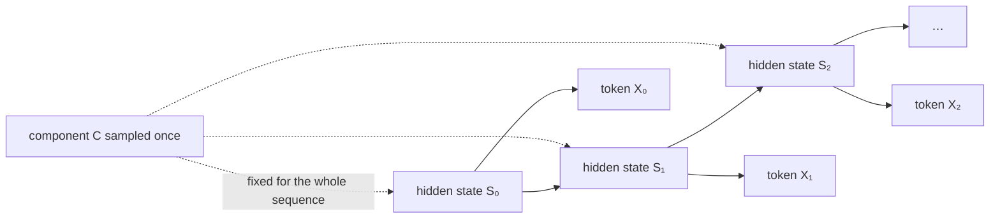
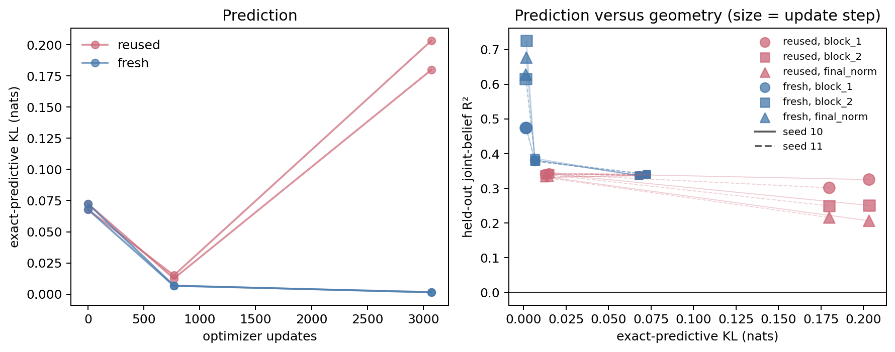
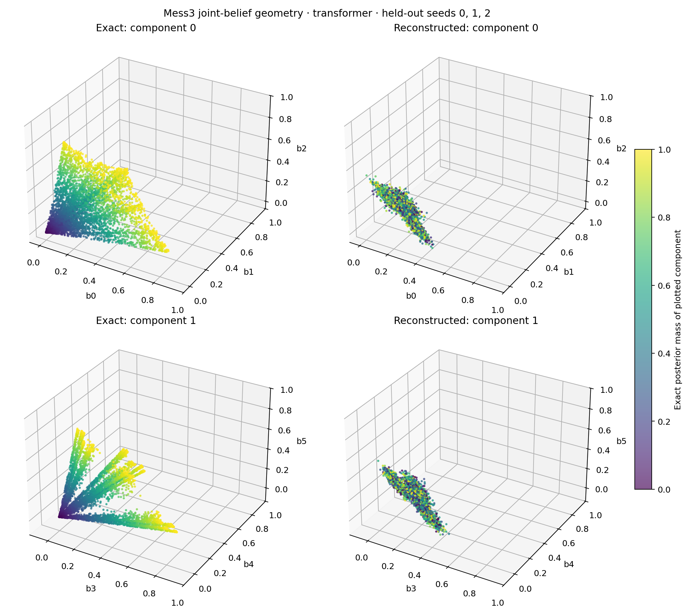
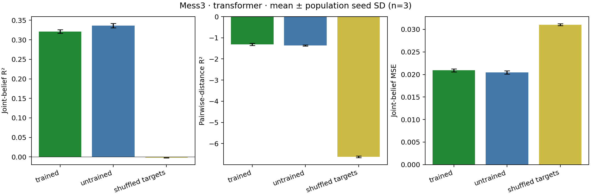
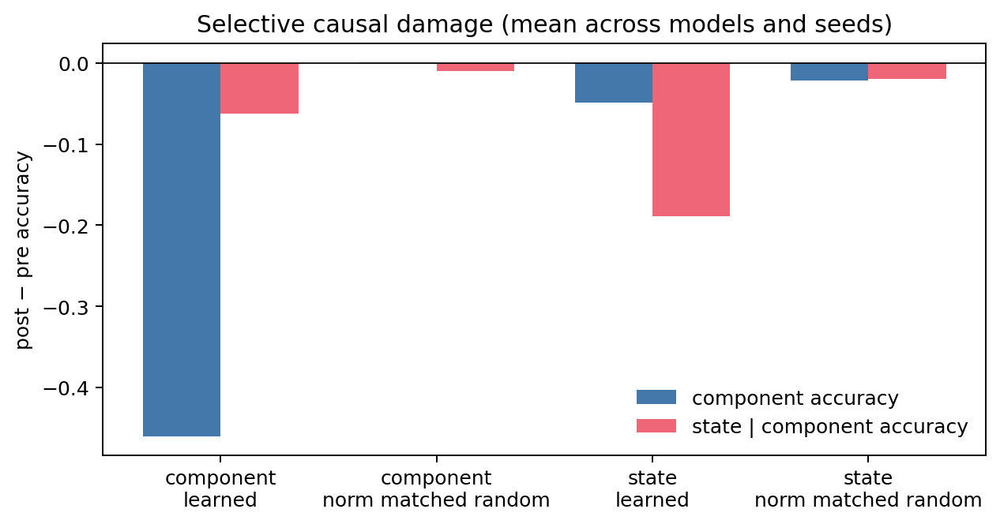

# nonergodic-memory

A CPU-reproducible test of whether small sequence models represent the Bayesian state of a data source—and whether those representations are causally necessary for prediction.

**Start here:** [scientific question](#why-generate-sequences-from-hmms) · [results](#results-at-a-glance) · [figures](#key-figures) · [reproduce](#reproduce) · [technical report](report.md) · [paper notes](paper_notes.md)

## The 60-second explanation

Real sequence data is heterogeneous: a document has an author, language, genre, and topic that persist while individual words change. [Ray, Riechers, and Shai's target study](https://belief-updates.pub/nonergodic-geometry/) formalizes a clean version of this problem: choose one source at the beginning of a sequence, keep that source fixed, and generate every token from its internal dynamics. A good predictor must infer both **which source is active** and **what is happening inside that source now**.

This repository turns that claim into a controlled experiment. The sources are small hidden Markov models (HMMs), so the exact Bayesian posterior and exact next-token distribution are computable at every position. A GRU and a decoder-only Transformer see only tokens. Held-out probes test whether their activations recover the exact beliefs; causal projections test whether removing those representations selectively damages behavior.

The result is deliberately mixed. The simpler HMM experiment recovers component information, but conditional-state and causal-erasure effects are architecture- and seed-sensitive. The first direct Mess3 reproduction fails its registered trained-over-untrained prediction. A later diagnosis shows that fresh data improves prediction at 768 updates without recovering component geometry; substantial geometry appears only after 3,072 fresh-data updates. That is evidence for a training/generalization confound, not an exact reproduction of the published number.

## Why generate sequences from HMMs?

An HMM is a probabilistic sequence generator: an unobserved state changes according to a Markov transition matrix, and each state emits observable symbols. The formal statistical lineage goes back at least to [Baum and Petrie (1966)](https://doi.org/10.1214/aoms/1177699147); [Rabiner's tutorial (1989)](https://doi.org/10.1109/5.18626) remains a standard introduction.

HMMs are used here as **measurement instruments**, not as a claim that natural language literally follows a three-state machine. With natural text, the correct latent state is unknown. With an HMM, the generator is known, which gives us:

- exact component identity and latent states for sampled sequences;
- exact Bayesian beliefs after every observed prefix;
- exact next-token probabilities against which neural predictions can be scored;
- controlled changes to source overlap, sequence length, state count, and component count.

The extra nonergodic step is to sample a component `C` once and never switch components inside that sequence:



The hidden state `S_t` evolves; the component `C` does not. Consequently the optimal predictor maintains a hierarchical belief:

`p(C, S_t | X_0:t) = p(C | X_0:t) p(S_t | C, X_0:t)`.

This distinction is why sequence generation matters. A single token can be compatible with both components, while a longer prefix reveals persistent source-specific statistics. The model needs memory to accumulate that evidence. The weighted coordinates above also define the “telescoping” geometry predicted by the target study. Related work showed that Transformer residual streams can linearly encode belief-state geometry even when it is fractal ([Shai et al., NeurIPS 2024](https://proceedings.neurips.cc/paper_files/paper/2024/hash/8936fa1691764912d9519e1b5673ea66-Abstract-Conference.html)).

## What is actually tested?

| Question | Ground truth | Quantitative test |
|---|---|---|
| Which source generated the sequence? | `p(C | X_0:t)` | held-out classification and posterior R² |
| Where is each source internally? | `p(S_t | C, X_0:t)` | component-conditional accuracy and posterior R² |
| Is the full telescoping belief represented? | `p(C,S_t | X_0:t)` | held-out joint-belief and pairwise-distance R² |
| Does the model predict correctly? | exact Bayesian `p(X_{t+1} | X_0:t)` | NLL and KL from Bayes |
| Is decoded information causally used? | learned activation subspaces | projection damage versus random, norm-matched, shuffled, and untrained controls |

PCA and three-dimensional projections are descriptive only. Registered predictions, held-out metrics, controls, and seed variability carry the evidential weight.

## Results at a glance

| Experiment | Outcome | Interpretation |
|---|---|---|
| Small two-state HMM mixture | Component posterior is linearly recoverable; state recovery is also high but training gains are inconsistent. | Partial conceptual reproduction, not blanket agreement. |
| Direct two-Mess3 reproduction | Registered prediction fails: trained joint-belief R² is `0.3212 ± 0.0047`, below untrained `0.3362 ± 0.0058`. | Exact source process alone is insufficient under the smaller architecture and training protocol. |
| Fresh-versus-reused diagnosis | At 768 updates, fresh data improves predictive KL but component R² stays near zero. At 3,072 fresh updates, deeper-layer joint-belief R² reaches `0.62–0.73`; reused training overfits. | Sequence reuse confounds prediction, while geometry recovery additionally requires more optimization. |
| Causal erasure | Learned directions show average selectivity, but effects vary by seed and architecture and sometimes occur in untrained networks. | No evidence for a universally stable, selectively necessary final-layer factorization. |

The full numerical record—including negative results and limitations—is in the [technical report](report.md).

## Key figures

### Predictive learning and geometric recovery



Fresh data improves exact-predictive KL by 768 updates, but the strong movement in held-out joint-belief R² occurs only by 3,072 updates. Color denotes data reuse, marker shape denotes activation site, marker size denotes checkpoint, and line style denotes seed.

### Exact versus reconstructed Mess3 geometry



The left panels are exact weighted-belief coordinates; the right panels are linear reconstructions from the initial direct reproduction. The visual collapse is a negative result, quantified below—this plot is not treated as proof by resemblance.

### Direct-reproduction metrics and controls



The trained model does not beat the untrained control on joint-belief R² or MSE in the original registered CPU run. Shuffled targets remain near zero, while negative pairwise-distance R² shows that neither trained nor untrained reconstructions recover global geometry accurately.

### Causal erasure



Removing learned component or state subspaces can selectively reduce the corresponding evaluator-probe accuracy, but seed variance is large and random/untrained controls prevent a simple causal-factorization claim.

## Reproduce

Python 3.11 or newer is required. The current checked-in run used Python 3.14 and CPU-only PyTorch execution.

```bash
python3 -m venv .venv
source .venv/bin/activate
pip install -e '.[test]'
make smoke       # seconds-scale end-to-end check, one seed
make train       # central config, seeds 0/1/2, both models
make reproduce   # held-out probes and PCA records (trains if needed)
make reproduce-mess3 # exact Mess3 process, three CPU Transformer seeds, weighted-belief metrics/figures
make diagnose-mess3 # exploratory fresh-vs-reused Mess3 training, checkpoints, probes, figures
make extension   # controlled causal erasure (trains if needed)
make figures     # reads only results/*.jsonl
make sweep-overlap # four overlap values × two models × three seeds
make sweep-length  # lengths 8/16/32/64 × two models × three seeds
make sweep-components # 2/3/4 components × two models × three seeds
make sweep-width   # widths 8/16/32/64 × two models × three seeds
make sweep-depth   # Transformer block 1/block 2/final norm × three seeds
make sweep-interaction # overlap 0/.35 × length 8/64 × two models × three seeds
make sweep-context-restart # length-64 models: full prefix vs last 8 tokens, exact Bayes oracle
make sweep-position-restart # Transformer: last 8 tokens with reset vs original position indices
make sweep-short-context # length-9-trained Transformer on the same held-out eight-token windows
make sweep-budget-context # short training matched to long model's token and optimizer-step budgets
make sweep-gru-budget-context # GRU architecture check of the matched-budget effect
pytest -q
```

`make reproduce` and `make extension` reuse matching checkpoints when present. Delete `checkpoints/reproduce/` to force retraining. `make clean-results` removes generated JSONL and PNG outputs but leaves checkpoints intact.

`make reproduce-mess3` uses `configs/mess3_cpu.yaml` and stores checkpoints in `checkpoints/mess3_cpu/`. It trains missing or incompatible seeds, requires matching raw training records, and regenerates both Mess3 figures from JSONL. The configuration is 2,048 length-64 training sequences, 24 epochs, width 32, two layers, and seeds 0/1/2. The recorded CPU run took 163 seconds initially and 35 seconds with cached checkpoints. It does not reproduce the paper's architecture or compute budget.

`make diagnose-mess3` uses `configs/mess3_diagnosis.yaml`. Exploratory seeds 10/11 compare a deterministic fixed pool with newly sampled sequences at every update, holding initialization, architecture, batch size, optimizer, sequence length, and update count fixed within each checkpoint comparison. It evaluates steps 0/768/3,072 against exact predictive baselines and probes every block plus final normalization. The uncached recorded command took 3:02:13 wall time on CPU; the large wall/user-time discrepancy was not profiled, so no single cause is claimed. Complete matching checkpoints and training records are reused; probe metrics and both figures are regenerated.

## Artifact map

- `src/nonergodic_memory/data/hmm.py`: sampling and exact Bayesian filtering.
- `src/train.py`: deterministic training and checkpoint production.
- `src/probe.py`: held-out classifiers, posterior regressions, shuffled labels, untrained controls, and PCA coordinates.
- `src/intervene.py`: learned, random, norm-matched, and shuffled-label subspace interventions.
- `configs/`: smoke and central CPU configurations.
- `results/`: raw JSONL records; every result states model, seed, condition, and device.
- `figures/`: regenerated exclusively from JSONL.
- `results/mess3_training.jsonl` and `results/mess3_reproduction.jsonl`: registered Mess3 training, normal/shuffled trained/untrained probes, and six exact plus six reconstructed belief coordinates per geometry point.
- `figures/mess3_geometry.png` and `figures/mess3_metrics.png`: descriptive weighted-coordinate projections and quantitative held-out joint-belief/distortion metrics.
- `results/mess3_diagnosis_*.jsonl`: exact predictive baselines, matched fresh/reused training curves, and layerwise normal/shuffled belief probes.
- `figures/mess3_predictive_baselines.png` and `figures/mess3_learning_geometry.png`: the available predictive signal and the relationship between predictive KL and held-out joint-belief recovery.
- `results/sweep_overlap_*.jsonl` and `figures/sweep_overlap.png`: the registered source-overlap extension.
- `results/sweep_length_*.jsonl` and `figures/sweep_length.png`: the registered sequence-length follow-up.
- `results/sweep_components_*.jsonl` and `figures/sweep_components.png`: the registered component-count sweep.
- `results/sweep_width_*.jsonl` and `figures/sweep_width.png`: the registered model-width sweep.
- `results/sweep_depth.jsonl` and `figures/sweep_depth.png`: layerwise Transformer erasure propagated through the remaining network.
- `results/sweep_interaction_*.jsonl` and `figures/sweep_interaction.png`: fresh matched overlap-by-context grid and paired interaction contrast.
- `results/sweep_context_restart.jsonl` and `figures/sweep_context_restart.png`: held-out eight-token restarts with an elapsed-prior exact Bayesian oracle.
- `results/sweep_position_restart.jsonl` and `figures/sweep_position_restart.png`: position-preserving Transformer restart control.
- `results/sweep_short_context*.jsonl` and `figures/sweep_short_context.png`: short-input training control joined to the published position-restart raw file.
- `results/sweep_budget_context*.jsonl` and `figures/sweep_budget_context.png`: token/step-matched short-input training control, joined to the two prior raw files.
- `results/sweep_gru_*context*.jsonl` and `figures/sweep_gru_budget_context.png`: GRU architecture-generalization check for matched training exposure.
- `STATE.md`: the current hypothesis → experiment → interpretation loop.
- `report.md`: methods, results, negative results, and limitations.

## Exact quantities and alignment

After observing token `x_t`, the filter stores the component posterior `p(c | x_0:t)`, every normalized within-component state posterior `p(s_t | c,x_0:t)`, and the next-token prediction `p(x_{t+1} | x_0:t)`. Neural logits at position `t` are evaluated against the same next token. Separate regressions target the unweighted `K×S` conditional-state vector and the weighted joint vector `p(c,s_t | x_0:t)`. The joint target sums to one across all entries; its component blocks sum to the component posterior. The conditional-state target sums to one within each block and is a different diagnostic. The hard-state diagnostic supplies the true component to a component-specific classifier, preventing component mistakes from being counted twice.

## Reproducibility boundary

Runs are deterministic on the tested CPU environment: data, initialization, batch order, probes, and random controls all use explicit seeds. Checkpoints are generated rather than versioned and are validated against the complete requested configuration, model, and seed before analysis. Partial CLI reruns atomically replace only matching result cells and preserve the rest of the grid. Raw records include a config hash and Python, NumPy, and PyTorch versions. Exact bitwise equality across different PyTorch/BLAS versions is not promised.

A checkpoint-free clone audit of the earlier two-state artifact ran its commands, all eleven sweeps, and the then-current 65 tests. Numerical JSONL values reproduced exactly and every figure was byte-identical on the recorded CPU environment. The new Mess3 run has a separate cached-checkpoint determinism audit described in `report.md`.

## Background references

- Leonard E. Baum and Ted Petrie, [“Statistical Inference for Probabilistic Functions of Finite State Markov Chains”](https://doi.org/10.1214/aoms/1177699147), *Annals of Mathematical Statistics* 37(6), 1966.
- Lawrence R. Rabiner, [“A Tutorial on Hidden Markov Models and Selected Applications in Speech Recognition”](https://doi.org/10.1109/5.18626), *Proceedings of the IEEE* 77(2), 1989.
- Adam S. Shai et al., [“Transformers Represent Belief State Geometry in Their Residual Stream”](https://proceedings.neurips.cc/paper_files/paper/2024/hash/8936fa1691764912d9519e1b5673ea66-Abstract-Conference.html), NeurIPS 2024.
- Kyle J. Ray, Paul M. Riechers, and Adam S. Shai, [“The Geometry of Nonergodic Composition”](https://belief-updates.pub/nonergodic-geometry/), Belief Updates, 2026—the target study reproduced and extended here.
