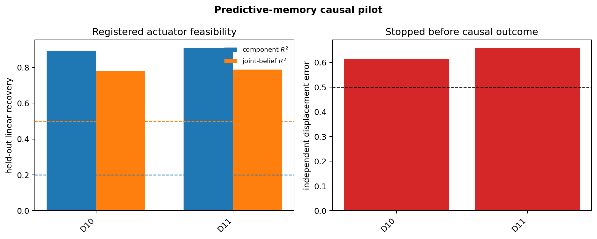

# Predictive-memory causal pilot: result

## Verdict

**Actuator infeasible at the registered block-1 memory site.** The immutable
command stopped at the development gate, exactly as registered. No held-out model
seed (20--24), causal response, shuffled actuator, random direction, or untrained
checkpoint was evaluated. Development evaluation prefixes were generated and
hashed as part of split isolation, but no behavioral outcome was scored. This is
a valid feasibility failure, not a falsification of all causal source memory.

The command was `/usr/bin/time -p make predictive-memory`. It completed on CPU
in 16.17 seconds wall time (14.08 user, 1.13 system). The scientific producer
took 8.716 seconds. Both the scientific attempt and full producer-plus-figure
command ended normally.

## Registered development gates

| metric | required | seed 10 | seed 11 | result |
|---|---:|---:|---:|---|
| component-posterior R² | ≥ 0.20 | 0.892812 | 0.908015 | pass/pass |
| five-coordinate joint-belief R² | ≥ 0.50 | 0.780860 | 0.788348 | pass/pass |
| retained actuator rank | 5 | 5 | 5 | pass/pass |
| construction residual ratio | ≤ 1e-10 | 8.76e-31 | 1.52e-30 | pass/pass |
| independent displacement error | ≤ 0.50 | **0.613391** | **0.658563** | **fail/fail** |
| mean oracle response energy | ≥ 1e-6 | 3.33e-4 | 3.21e-4 | pass/pass |
| edit RMS p95 | ≤ natural p95 | 0.00578 ≤ 1.04818 | 0.00591 ≤ 1.11262 | pass/pass |
| dose-zero identity error | ≤ 1e-6 | 5.96e-8 | 5.96e-8 | pass/pass |
| full oracle enumeration error | ≤ 1e-10 | 1.94e-16 | 1.67e-16 | pass/pass |

All four split pairs are exactly disjoint in both seeds, all recorded values are
finite, both checkpoint hashes match preflight hashes, and the shared evidence
analyzer reproduces the stopped status.

## Interpretation

The whole 32-token block-1 tensor contains highly linearly decodable source and
joint-belief information. The fitted decoder also has full target rank and can
install its own requested displacement with negligible algebraic residual using
very small standardized edits. Those facts are not sufficient for a valid causal
actuator: an independently fitted decoder sees 61--66% relative squared error in
the requested belief displacement, above the preregistered 50% ceiling in both
development seeds.

This separates **decodability** from **coordinate-stable controllability**. A
linear readout can predict the belief well while its minimum-norm inverse depends
too strongly on the particular fitted decoder to support a causal interpretation.
Proceeding to behavioral outcomes would therefore risk measuring decoder-specific
off-manifold perturbations rather than a source-belief intervention.

The result does not show that the model lacks source memory, that no nonlinear or
manifold-constrained actuator could work, or that another layer would fail. Those
are new hypotheses requiring a new protocol and untouched model seeds. Per the
lock, this pilot does not search another layer, cutoff, regularizer, target, or
amplitude after observing the failure.

## Evidence and reproducibility

The figure below is regenerated only after the stage-aware analyzer verifies the
raw rows and summary:



Files and SHA-256 hashes:

| artifact | SHA-256 |
|---|---|
| `results/predictive_memory.jsonl` | `310d7949e0acf6ff3da00c5fa1c5230fb0139fd5335a518484644d902dea784d` |
| `results/predictive_memory_summary.jsonl` | `a1d0981c6e1dd996f65d787e75290c7fce6ed80b63bb14bd101114780fade02d` |
| `results/predictive_memory_attempt.jsonl` | `7e358b06d3586023e52eafbb24df266cc38ee976d0ab3dc207edf71bc51e37ea` |
| `results/predictive_memory_watchdog.jsonl` | `80ca9ad2d7400de5991d7e8d8e63f79d56e70f60fb03bf43958ad6902e2194f0` |
| `results/predictive_memory_command.jsonl` | `f9ce106f541b9519955be8fa4ce14611c9178064524fb0b1884bd9c147a1f4ef` |
| `figures/predictive_memory.png` | `931d74f71428a837c97820edcc9486a544fba95592af68b272be2a8dc067a209` |

Because the registered attempt is immutable, `make predictive-memory` now
refuses a second invocation. To regenerate the checked-in figure without touching
checkpoints or scientific evidence:

```bash
PYTHONPATH=src python -m nonergodic_memory.predictive_memory_figures
```

The protocol and its pre-data clarification are in [PROTOCOL.md](PROTOCOL.md).
