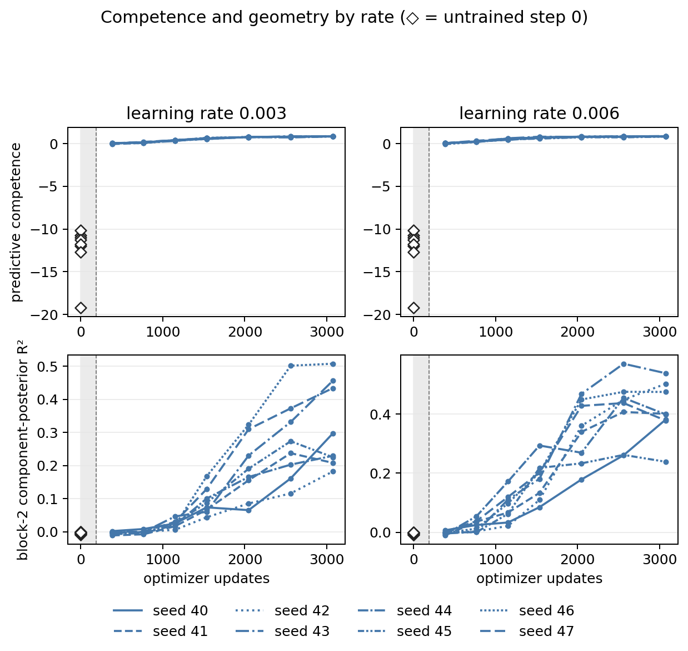
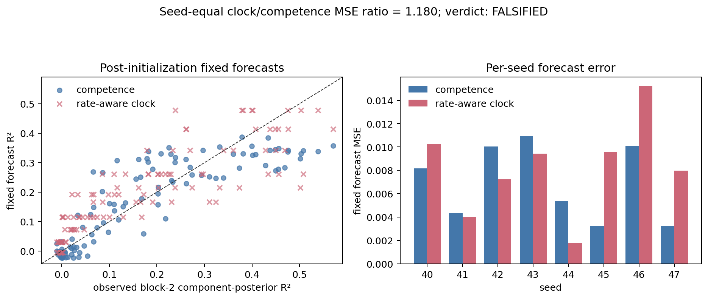

# Rate-aware clock external validation: results

Frozen verdict: **falsified**. Completed on 2026-09-28.

The frozen rate-aware clock has seed-equal MSE **0.008177847709212512**,
versus **0.006933045029332025** for the frozen competence forecast. The
clock/competence ratio is **1.1795463140097937**, failing the strict
`< 0.80` criterion. The clock wins **4/8 seeds**, failing the required
`>= 7/8`. Every registered validity check passes; `validity_failures`
is empty. This is a valid negative confirmation, not an inconclusive run.

## Question and prior evidence

The [protocol](PROTOCOL.md) tests whether the equal-capacity quadratic clock
`log1p(learning_rate * step)` transports better than predictive competence
to new random seeds as a forecast of post-initialization block-2
component-posterior R². Both three-coefficient forecasts were fitted once on
all 256 eligible retained cells from seeds 30–37 and frozen before seeds
40–47. No confirmation geometry selected, fitted, calibrated, or clipped
either forecast.

The motivation was exploratory: on the old seeds, the rate-aware quadratic
had grouped LOSO MSE 0.006086 versus competence's 0.008194 and won six of
eight folds. Those old-data calculations selected this hypothesis; they were
not independent confirmation. Their apparent advantage did not transport
under the newly registered success rule.

The earlier results remain unchanged. The global initialization-plus-training
threshold claim is falsified (competence/log-step ratio 2.378). The separately
registered [competence–time experiment](../competence_time/RESULTS.md) is
supported for its post-initialization comparison against rate-unaware
`log1p(step)` (ratio 0.457231830704, eight of eight LOSO folds). Neither
earlier verdict is revised by this new comparator.

## Frozen design and lock

The approved code lock is
`933f50fc22e72ce4f264b811fc09e039bfe10cad`; the published documentation
lock is `d1b388054a2cf5ebbac3040a8346f80faf1082a3`. Before any confirmation
producer ran, a fresh remote-head query confirmed that exact documentation
commit on `origin/experiment/rate-aware-clock`; the local branch was clean
and synchronized. The publication boundary was recorded in the private
execution report before the command began.

The preflight compared every tracked source, test, script, and Makefile with
the approved code lock and checked exact config/protocol bytes. An exhaustive
worktree scan, including ignored files and JSONL contents, found zero
rate-aware or seed-40–47 checkpoints, result rows, or figures. The earlier
preregistration-through-code-lock history scan also found zero.

- Base configuration digest: `59f938bbff48f300`.
- Rate-specific digests: 0.003 → `59f938bbff48f300`;
  0.006 → `8ca278430706b779`.
- YAML SHA-256:
  `8091283fe375156b25c5dd0ec399259a8bb9eda1a6b850d9b19605c6ca59df85`.
- Protocol SHA-256:
  `dbffa10016be7ab11a3c2564465788a7ae60b835bd40738d371656643bf04b88`.
- Frozen old training JSONL SHA-256:
  `2c90e72389db3a98e0c1196fffaf6bdf24f3492009460bfbe0c99f417315420f`.
- Frozen old probe JSONL SHA-256:
  `9a7aa242f267bddc2064c8ddf93c3163891167630d7dd3f0ea4e603993e3abd3`.

The complete grid is seeds 40–47 × rates 0.003/0.006 × checkpoints
0/384/768/1152/1536/2048/2560/3072: 16 fresh-data trajectories,
128 training rows, 768 layer/control probe rows, eight token-audit rows,
one summary, and 128 ignored local checkpoints. The primary comparison uses
112 normal-control block-2 observations, exactly 14 per seed. All 16
initialization training cells and 96 initialization probe rows are retained
as controls and excluded from the primary forecasts and support checks.

The model is the locked width-32, two-block, four-head Transformer, trained
on fresh batches of 64 length-64 sequences with AdamW weight decay 0.01.
Same-seed rate conditions share initialization, step-indexed batches,
evaluation data, and probe splits. Competence uses evaluation positions
7–62 from 256 sequences; geometry pools input positions 0–62 with 1,024
probe-fit and 512 probe-test sequences. The unchanged probe is
StandardScaler followed by multi-output Ridge (`alpha=1.0`), reporting
uniform-average multi-output R².

## Every seed and the registered decision

Each error is the mean over that seed's 14 primary observations; the two
aggregate errors are means of the eight seed errors. Seed outcomes are
clustered replications given frozen forecasts, not LOSO refits or an exact
LOSO sign test. The final column reports each seed's largest absolute
same-step competence difference between the two rates.

| Seed | Observations | Clock MSE | Competence MSE | Lower error | Maximum rate difference |
| --- | ---: | ---: | ---: | --- | ---: |
| 40 | 14 | 0.010231742462030 | 0.008153224910016 | Competence | 0.203025526625 |
| 41 | 14 | 0.004013622241116 | 0.004337112667630 | Clock | 0.165708016725 |
| 42 | 14 | 0.007212014394613 | 0.010048444469737 | Clock | 0.121006268196 |
| 43 | 14 | 0.009417730904979 | 0.010956017337821 | Clock | 0.215172067035 |
| 44 | 14 | 0.001800450703523 | 0.005384855628040 | Clock | 0.196815280329 |
| 45 | 14 | 0.009554464067361 | 0.003234835335347 | Competence | 0.134316864888 |
| 46 | 14 | 0.015234590842054 | 0.010090064076354 | Competence | 0.188164657427 |
| 47 | 14 | 0.007958166058024 | 0.003259805809711 | Competence | 0.184873920084 |
| Seed-equal mean | 112 total | 0.008177847709213 | 0.006933045029332 | Competence | — |

Clock wins occur in seeds 41–44; competence wins in 40/45/46/47.
There are no ties. The descriptive symmetric competence/clock ratio is
**0.8477835826560831**, with competence winning **4/8 seeds**. That
comparison cannot replace the preregistered clock-superiority hypothesis.

Both required directional criteria fail, despite valid manipulation and
measurement. The new result rejects the specified external-transport claim.
It does not establish equivalence, universal competence superiority, or
causal irrelevance of optimization time.

## Validity audit before interpretation

The full raw grid was audited before the saved verdict was read. Separate
calculations reconstructed parameter hashes, token hashes, per-seed errors,
aggregate errors, and scientific validity outcomes. The saved summary is
exactly equal to a fresh call of the locked analyzer, and its primary scores
are exactly equal to the separate seed-equal calculation.

| Registered condition | Observed evidence | Status |
| --- | --- | --- |
| Complete finite grid | Exact unique 128 training / 768 probe / 8 audit / 1 summary records; all required and other recorded numerical values finite; all 128 checkpoints and 3,840 state tensors finite | Pass |
| Frozen forecast provenance | Exact serialized configuration constants and both source hashes; independent 256-row refit reproduces centers, population scales, coefficients, and support within absolute tolerance `1e-12` | Pass |
| Shuffled-label bound | All 112 primary shuffled values lie in [−0.011172377858478355, 0.006795481659352176]; maximum absolute value 0.011172377858478355 ≤ 0.02 | Pass |
| Actual token isolation | 14,336 deterministic length-64 sequences reconstructed; complete dataset hashes/counts match all eight audits; all 24 within-seed evaluation/fit/test pairwise intersections are zero; all 768 raw probe-overlap fields are zero | Pass |
| Rate manipulation | All eight per-seed differences in the table exceed 0.10; required at least six seeds | Pass |
| Forecast support | All 112 competence and clock inputs within frozen old-data support; no out-of-support cells | Pass |
| Pairing and identity | Step-zero parameter hashes and predictive measurements match across rates in all eight seeds; every training/probe row binds to its canonical checkpoint, full rate config, fresh condition, sampler, and parameter SHA-256 | Pass |
| No adaptive recovery | One uninterrupted invocation; exactly 32 producer starts and 32 completions; zero failed attempts, infrastructure retries, scientific retries, replacements, or added cells | Pass |

Observed versus frozen predictor support:

| Predictor | Observed primary range | Frozen permissible range |
| --- | --- | --- |
| Competence | [−0.070055640895764, 0.8823848037250308] | [−0.24055542481822356, 0.8940463808722273] |
| `log1p(rate * step)` | [0.766397642299538, 2.9669211916998717] | [0.2530906276821619, 3.2416544117575405] |

Every JSONL line parsed as a strict JSON object with unique keys, no blank
records, and no NaN/Infinity or nonfinite nested numeric values. Every training
and probe row records CPU execution and Python 3.14.2, NumPy 2.4.1, PyTorch 2.11.0.
Recorded competence exactly equals `1 - kl_exact / uniform_kl` and uses
14,336 evaluated prediction positions per checkpoint. Step zero contributes
to neither forecast error nor predictor-support validation. The code,
configuration, protocol, and all frozen competence-time artifacts remain
byte-identical to the pre-execution lock.

## Execution and verification

Exactly one command ran, from the clean synchronized branch in zsh:

```console
set -o pipefail; /usr/bin/time -p make rate-aware-clock 2>&1 | tee /tmp/nonergodic-rate-aware.uKcc63/rate-aware-execution.log
```

Exit status: **0**. Complete output:

```text
bash scripts/mess3_rate_aware_clock.sh
rate-aware clock verdict: falsified
generated figures/mess3_rate_aware_clock_learning.png
generated figures/mess3_rate_aware_clock_forecasts.png
real 3479.48
user 3114.70
sys 332.54
```

Wall time is **57 min 59.48 s**; user time is **3,114.70 s** and system
time **332.54 s**. The timer includes training, probing, deterministic audit,
analysis, and initial figure generation, but excludes later verification.
Only process liveness and attempt kind/status counts were monitored during
execution. Apparent scientific results were not inspected while it ran.

Execution-log SHA-256:
`2e216d019ad87e81ced41c7fe7295242deef1ec23a933fea63dc1f22d7e14e07`.
The ignored local attempt log has 64 events and SHA-256
`d7b64c8b0e4d4cab300f3acf21845a3cbd62473554f43ebea655b410d249eb32`.
The private execution report retains full command logs, preflight/source
hashes, every checkpoint byte hash, and the separate audit calculations.

Final verification: `PYTHONPATH=src pytest -q` passed **470 tests in 260.77 s**
(0:04:20), exit 0. `make smoke` completed training, probing, interventions,
and all four legacy figures, exit 0. Its unrelated rewrites of
`results/smoke_training.jsonl` and `results/smoke_reproduction.jsonl` were
inspected: every original field was unchanged, with only current-schema fields
added. Exactly those two files were restored. Independent raw-result and
whole-branch reviews remain a publication gate.

## Figures and reproducibility





Both plots are generated solely from the retained JSONLs using the locked
figure implementation. A second generation produced byte-identical PNGs and
left all four JSONL hashes unchanged; no metadata exception or semantic-only
comparison was needed. Both rendered figures were visually inspected. Step-zero
diamonds are separate controls, and the forecast panel excludes them.
The learning figure's common initialization/training competence scale
compresses post-initialization differences; similar seed line styles and
overlapping points also limit visual discrimination. These locked display
choices were not changed after results. The numerical seed table and raw
records carry the quantitative comparison.

A checkpoint-free figure regeneration uses only configuration and checked-in
raw JSONLs; it does not train or probe:

```bash
PYTHONPATH=src python - <<'PY'
from nonergodic_memory.experiment import load_config
from nonergodic_memory.mess3_rate_aware_clock import read_rate_aware_jsonl
from nonergodic_memory.mess3_rate_aware_clock_figures import generate_rate_aware_clock_figures
config = load_config("configs/mess3_rate_aware_clock.yaml")
training, probes, audit, summaries = [
    read_rate_aware_jsonl(f"results/mess3_rate_aware_clock_{kind}.jsonl")
    for kind in ("training", "probes", "audit", "summary")
]
generate_rate_aware_clock_figures(config, training, probes, audit, summaries[0], "figures")
PY
```

The full CLI deliberately rejects raw records without their matching
checkpoints. A fresh clone therefore uses the recipe above for figures;
an independent training reproduction must use separate empty result and
checkpoint paths rather than overwrite the retained confirmation evidence.
Checkpoint-free retraining equality and equality across library/BLAS versions
were not tested in this confirmation.

## Artifact SHA-256

| Artifact | SHA-256 |
| --- | --- |
| `results/mess3_rate_aware_clock_training.jsonl` | `dd32ba490a5286925a5d6f1987e0558000d8bb54aede7c54988c20e4fab14b95` |
| `results/mess3_rate_aware_clock_probes.jsonl` | `361269cac8351bf7ac313e411194e647541115abec49e9a85c308d802310deed` |
| `results/mess3_rate_aware_clock_audit.jsonl` | `81186ea8c2d70c110208dd48e431be98fb4fd2a238e13f3f2fd25b637e03f908` |
| `results/mess3_rate_aware_clock_summary.jsonl` | `7a6ea98c397e28f0af06349a72fb8c67aa720b7695c1dc0ceb7b85169a32861e` |
| `figures/mess3_rate_aware_clock_learning.png` | `f7dd0418197db98844c0459682f1e5c16eeb06c39a0e14ef596cd5b084a44cf3` |
| `figures/mess3_rate_aware_clock_forecasts.png` | `8b2477d8b812bec6b6a03bd020fee808ff21299f1c47f8c4cb341f5da5f185cf` |

## Interpretation and limitations

The old-data rate-aware advantage failed this external test: aggregate error
is higher and seed directions split evenly. Predictive competence has lower
aggregate error here, but its symmetric ratio and four seed wins are
descriptive, not a newly registered positive claim. The earlier raw-step
comparison stays supported and the earlier global threshold claim stays
falsified.

This study tests transport only across new random realizations of the
selected Mess3 generator, small architecture, two tested learning rates, and
seven trained checkpoints. It does not test unseen rates, architectures,
generators, or optimization algorithms. Eight seeds provide limited power;
there is no p-value success rule and failure does not establish equivalence.

The competence forecast consumes contemporaneous held-out behavior, while
the clock consumes predetermined training metadata. Their forecasting
comparison does not identify which variable causes representation learning.
The competence/geometry position mismatch is inherited for comparability.
Linear recoverability does not show causal use of the representation, and
there is no intervention in this experiment. Both simple quadratic forecasts
can miss seed-specific or non-quadratic dynamics.

No thresholds, exclusions, seeds, predictors, coefficients, code, or plots
were changed after inspection. No secondary analysis rescues the failed
prediction. Any causal-predictive-memory pilot is a separate exploratory study
requiring its own committed numerical compute budget, development/confirmation
allocation, intervention-validity criteria, and stopping rule before it begins.
